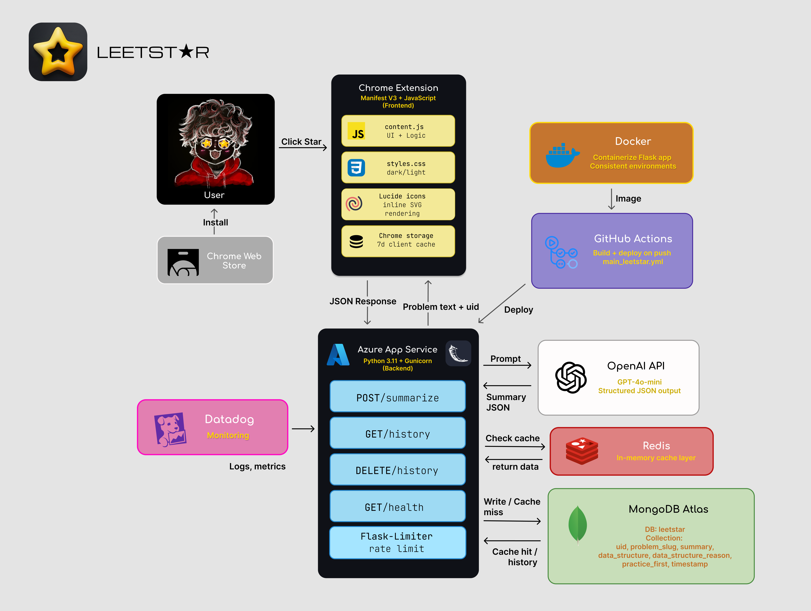

<div align="center">
  
  <h1>LEETST★R</h1>
  <p>
    <i>The AI-powered companion that decodes LeetCode complexity in real-time.</i>
  </p>
  <p>
    <a href="https://github.com/zarifislam10/leetcode-ai-summarizer/releases"><b>Install Extension</b></a> •
    <a href="https://github.com/zarifislam10/leetcode-ai-summarizer/issues/new?labels=bug&template=bug_report.md"><b>Report Issue</b></a> •
    <a href="https://github.com/zarifislam10/leetcode-ai-summarizer/issues/new?labels=enhancement&template=feature_request.md"><b>Suggest Feature</b></a>
  </p>
  <p>
    
    
    
    
  </p>
</div>


## Features

- **One-Click Analysis**: Click the ★ star button on any LeetCode problem page for an instant AI-powered breakdown
- **Plain-English Summaries**: Understand what the problem is actually asking without decoding the description
- **Data Structure Recommendations**: Get the best algorithm/DS to use with a clear reason why
- **Practice First**: Suggests an easier foundational problem to solve before tackling the current one
- **Summary History**: View your past 20 analyzed problems, stored in MongoDB and synced via unique browser ID
- **Smart Caching**: Client-side (7-day) and server-side caching to minimize API calls and speed up responses
- **Dark/Light Mode**: Toggle between themes to match your LeetCode setup
- **Customizable View**: Hide or show the Data Structure and Practice First sections
- **Copy to Clipboard**: One-click copy on any summary

## Tech Stack

### Frontend & Extension


### Backend & AI


### Database & Infrastructure


## Architecture

<p align="center">
  
</p>

## Quick Start

### Installation (Users)

1. Download the extension from the [Chrome Web Store](#) *(coming soon)*
2. Navigate to any `leetcode.com/problems/...` page
3. Click the ★ star button in the top-right corner
4. Get your summary instantly

### Local Development

#### 1. Clone the repo

```bash
git clone https://github.com/zarifislam10/leetcode-ai-summarizer.git
cd leetcode-ai-summarizer
```

#### 2. Backend Setup

```bash
cd backend
python -m venv venv
source venv/bin/activate  # Windows: venv\Scripts\activate
pip install -r requirements.txt
```

Create a `.env` file in `backend/`:

```
OPENAI_API_KEY=sk-your-key-here
MONGODB_URI=mongodb+srv://<USERNAME>:<PASSWORD>@cluster.mongodb.net/leetstar
```

Run the server:

```bash
python app.py
```

The server runs on `http://localhost:5000`.

#### 3. Load the Extension

1. Open Chrome and go to `chrome://extensions`
2. Enable **Developer Mode** (top right toggle)
3. Click **Load unpacked** and select the root project folder
4. Navigate to any LeetCode problem page
5. Click the ★ star button

> Note: For local development, update `BACKEND_URL` in `content.js` to `http://localhost:5000/summarize`.

## Project Structure

```
leetcode-ai-summarizer/
├── .github/
│   └── workflows/
│       └── main_leetstar.yml    # CI/CD pipeline
├── backend/
│   ├── app.py                   # Flask API (summarize, history, health)
│   ├── requirements.txt         # Python dependencies
│   └── startup.txt              # Azure startup command
├── content.js                   # Chrome extension logic
├── styles.css                   # UI styles (dark/light mode)
├── manifest.json                # Chrome extension manifest (MV3)
└── README.md
```

## API Routes

| Method | Route | Description |
|--------|-------|-------------|
| GET | `/health` | Health check |
| POST | `/summarize` | Analyze a LeetCode problem via GPT-4o-mini |
| GET | `/history?uid=` | Get last 20 summaries for a user |
| DELETE | `/history?uid=` | Delete all history for a user |
| DELETE | `/history?uid=&slug=` | Delete a single history entry |

## Deployment

The backend is deployed on **Azure App Service** with CI/CD via GitHub Actions.

- Every push to `main` triggers an automatic build and deploy
- Azure's Oryx build engine installs Python dependencies on deployment
- Environment variables (`OPENAI_API_KEY`, `MONGODB_URI`) are set in Azure App Settings

## Security

- API keys live only in environment variables — never in client code
- OpenAI API key is server-side only; the extension never sees it
- Problem text is capped at 3,000 characters before sending to OpenAI
- Each browser install gets a unique anonymous ID (no personal data collected)

## Roadmap

- [x] GPT-powered problem analysis
- [x] Azure deployment with CI/CD
- [x] MongoDB history with cross-device support
- [x] Client-side caching (7-day expiry)
- [x] Server-side caching (shared across users)
- [x] Dark/Light mode
- [x] Collapsible sections (Data Structure, Practice First)
- [ ] Chrome Web Store publication
- [x] Rate limiting with Flask-Limiter
- [ ] Redis caching layer
- [ ] Datadog monitoring
- [ ] Docker containerization
- [x] System design diagram

## Contributing

Contributions are welcome!

1. Fork the repository
2. Create a feature branch (`git checkout -b feature/your-feature`)
3. Commit your changes (`git commit -m "add your feature"`)
4. Push to the branch (`git push origin feature/your-feature`)
5. Open a Pull Request

## Acknowledgments

- Built with [OpenAI GPT-4o-mini](https://platform.openai.com/) for problem analysis
- [LeetCode API](https://github.com/alfaarghya/alfa-leetcode-api) for practice problem slug verification
- Deployed on [Microsoft Azure](https://azure.microsoft.com/) with [MongoDB Atlas](https://www.mongodb.com/atlas)

### Project Evolution
LEETST★R is the full-stack evolution of my original 2025 "LeetCode AI Summarizer" project. 

**v1.0 (March 2025)** was a client-side proof-of-concept focused on real-time extraction. 

**v2.0 (Current)** re-architected the system with a Flask backend, MongoDB persistence,
Azure CI/CD deployment, and a polished dark/light UI.

---

Made with ★ for LeetCoders everywhere
